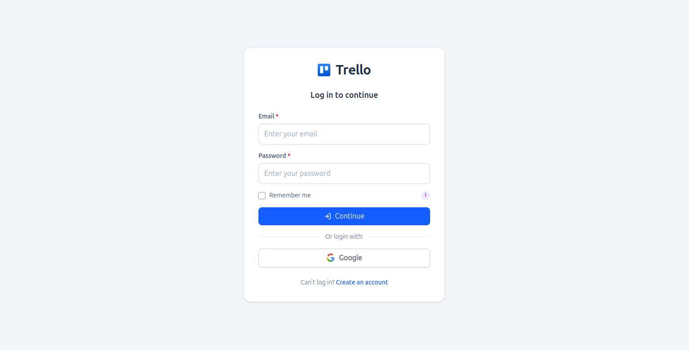
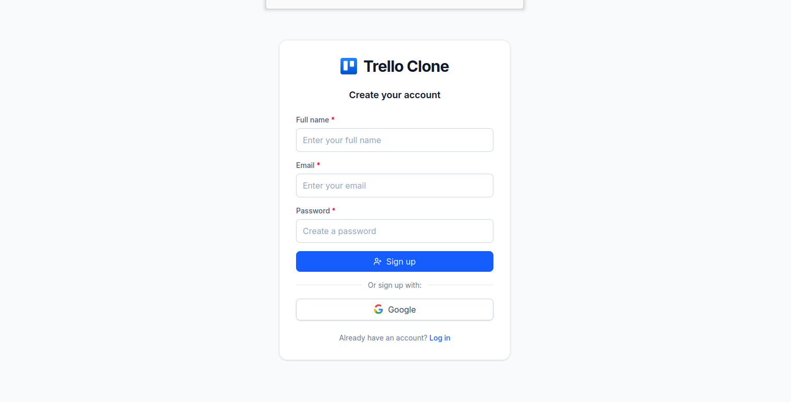
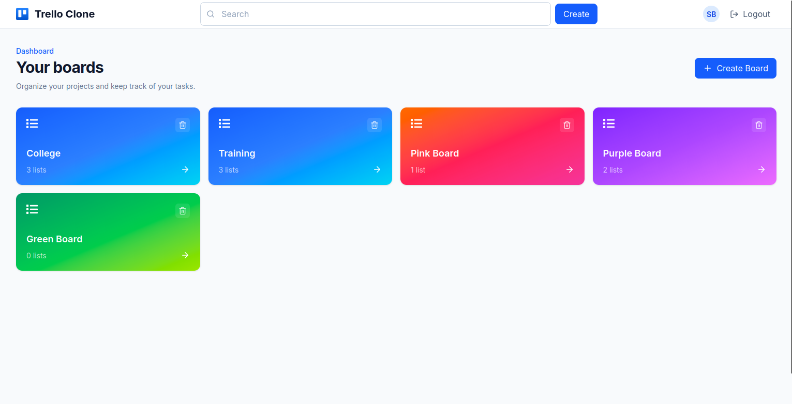
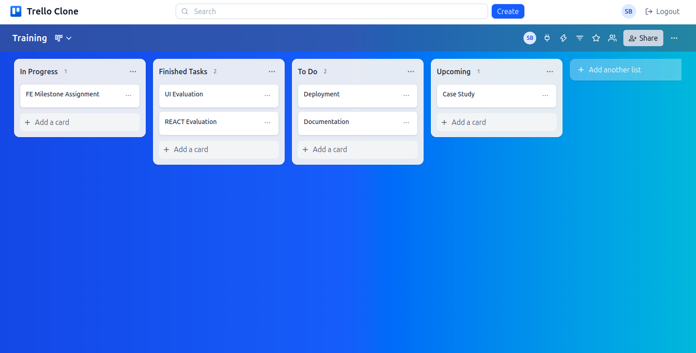

# Trello Clone

A Trello clone built with React and Firebase. It allows users to create boards, add lists inside boards, create cards within lists and manage cards using a drag-and-drop interface.

## Deployment

Deployment link: 

## Features

* Email/password and Google authentication
* Dashboard to view all boards
* Create and delete boards
* Create, edit, and delete lists
* Create, edit, and delete cards
* Drag and drop cards between lists
* Responsive layout
* Firebase Firestore for storing application data

## Tech Stack

* React + Vite
* Firebase Authentication/Firestore
* Tailwind CSS
* @dnd-kit 
* Vercel for deployment

### Firebase

`src/firebase/firebase.js` contains the Firebase configuration and initializes Firebase Authentication and Firestore.

`src/firebase/firestoreService.js` contains the reusable Firestore operations used throughout the project.

The `services` folder contains functions specific to different parts of the application, such as boards, lists, and cards.

### Prerequisites

Make sure you have the following installed:

* Node.js
* npm

### Installation

Clone the repository:

```bash
git clone https://git.beehyv.com/saroja.bamra/trello-clone
```

Go into the project directory:

```bash
cd trello-clone
```

Install the dependencies:

```bash
npm install
```

### Firebase Setup

Create a Firebase project and enable:

* Authentication

  * Email/Password
  * Google
* Firestore Database

Create a `.env` file in the root of the project and add your Firebase configuration:

```env
VITE_FIREBASE_API_KEY=your_api_key
VITE_FIREBASE_AUTH_DOMAIN=your_auth_domain
VITE_FIREBASE_PROJECT_ID=your_project_id
VITE_FIREBASE_STORAGE_BUCKET=your_storage_bucket
VITE_FIREBASE_MESSAGING_SENDER_ID=your_messaging_sender_id
VITE_FIREBASE_APP_ID=your_app_id
```

Make sure `.env` is included in `.gitignore`.

### Run the Project

Start the development server:

```bash
npm run dev
```

The application will be available at the local URL shown in the terminal.

## Screenshots




### Dashboard


### Board


